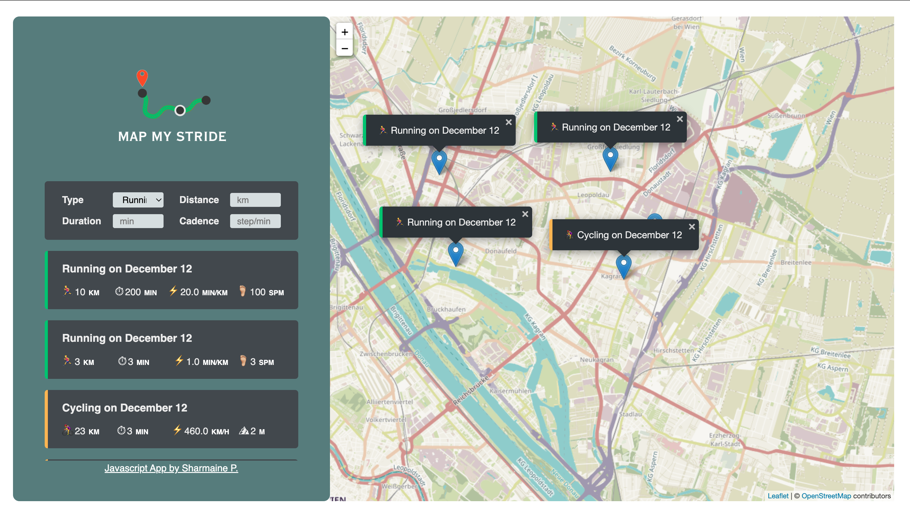

<h1 align="left">Map My Stride</h1>

###

Embark on your fitness journey with Map My Stride, a dynamic web application crafted using JavaScript. Log your workouts effortlessly and explore your progress with an interactive and intuitive experience.

###

<h2 align="left">Key Features</h2>

###

  - Utilizes the Leaflet library to display interactive maps.  
  - Retrieves the user's current position using the Geolocation API.  
  - Allows users to log running and cycling workouts. 
  - Renders logged workouts in a sidebar list with details such as distance, duration, elevation and, for running, cadence. 
  - Places markers on the map for each logged workout, indicating the workout type. 
  - Captures cadence for running workouts and elevation gain for cycling workouts. 
  - Stores workout data locally in the browser using the browser's API. 
  - Ensures that workout data persists, so it's available each time the page is loaded. 

###
###
###

###
